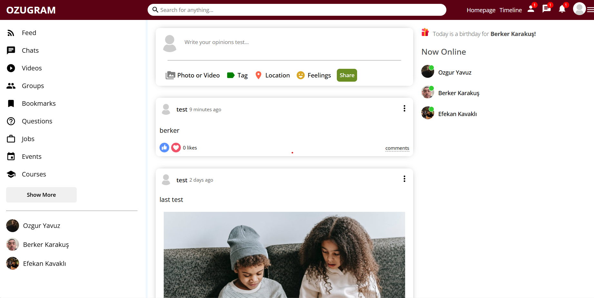
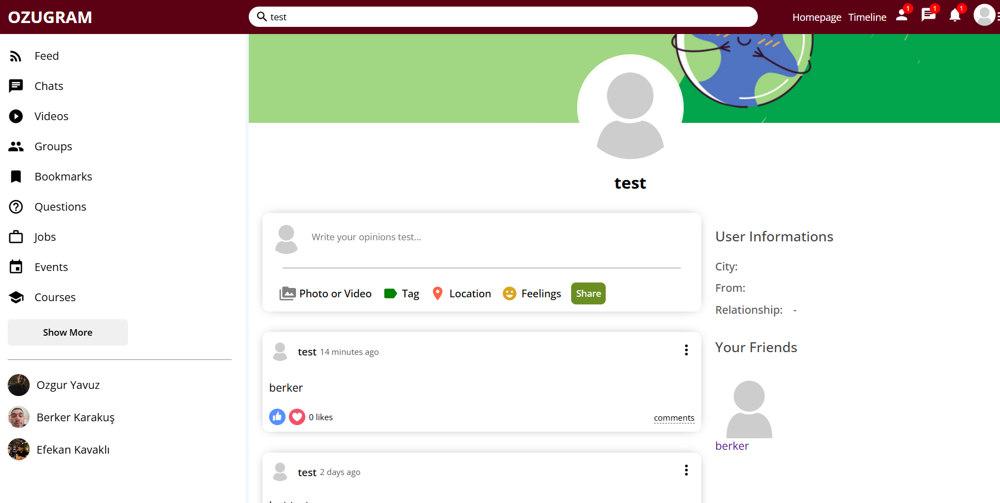
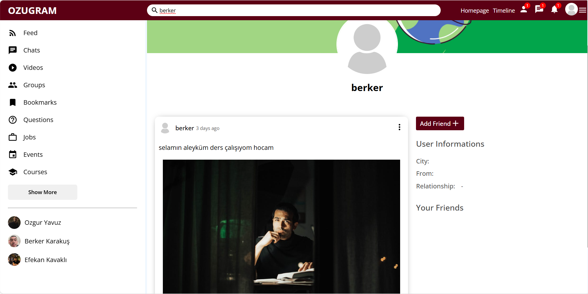
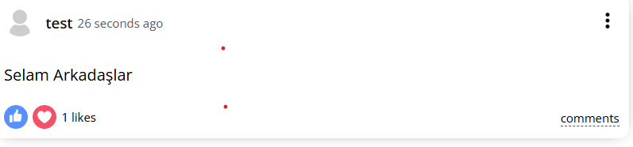
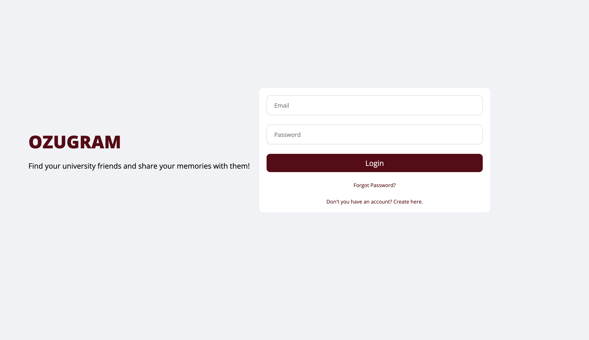
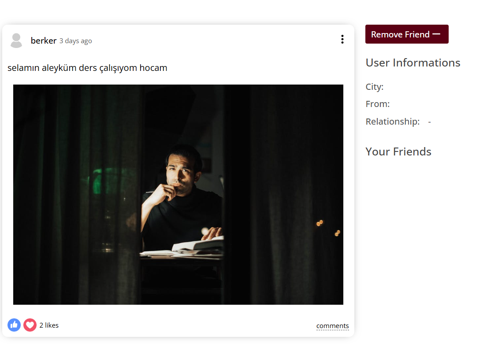

 # 1. PROJECT DESCRIPTION
Ozugram is a web-based social media platform designed specifically for Ozyegin University students. Its primary objective is to help students find their university friends and share memories with them. The platform provides an easy-to-navigate and accessible environment where students can connect, interact, and share their experiences. Key features of ozugram include personalized profiles, user authentication, photo and video sharing, liking posts and adding-removing friend functionalities.

# 2. USAGE SCENARIOS

Landing on ozugram:

-A user lands on the homepage where featured posts and university events are displayed prominently.

Using Filters:

-User can go to his/her own profile by clicking on profile photo symbol.

Viewing a Friend's Profile:

-From the search results, User clicks on a friend's profile to learn more and see their posts.

Interacting with a Post:

-Intrigued, User clicks on the "Like" button and leaves a comment on a friend's post.

Visiting the Sign-Up Page:
-2.png>)
-A new visitor clicks on the "Sign Up" button and is directed to the sign-up form.

Entering Details:
-Visitor fills in their details, including username, email, password, and student ID.

Log-in Screen:

-User can login with Log-In screen.

Adding-removing:

-A user can add or remove friend.

Sharing a Memory:
-1.png>)
-User canuploads a photo, video or text based posts with share button.

# 3. FLOW CHART DIAGRAM

# 4. RESPONSIBILITIES OF EACH PROJECT MEMBER
## Özgür Tuna Yavuz:

Managing project overlay and overall coordination.
Providing support for MongoDB, API, and JavaScript.
Ensuring smooth integration of React.js components.

## Berker Karakuş:
Coding in JavaScript with a focus on React.js.
Developing and integrating front-end components.
Managing the GitHub repository.

## Efekan Kavaklı:
Creating and maintaining the ReadMe documentation.
Adjusting React.js components.
Developing and maintaining the Node.js API backend.

# 5. INSTRUCTIONS FOR RUNNING PROJECT

To run the application you need to use 2 terminal and write:
First you have to run API.

1st Terminal
1-> `cd api`
2-> `npm start`

2nd Terminal
1-> `cd client`
2-> `npm start`

Then you can use application.

